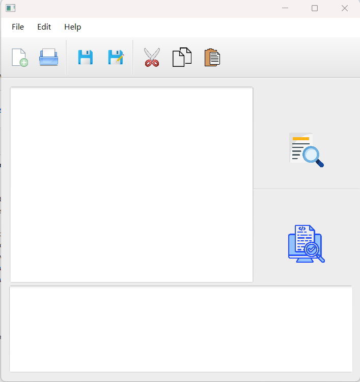

## TINY language Scanner & Parser project

To run the exe file
Please download jdk 18.0.1.1 and javafx 21 and set enviroment variables
Do the following steps:
<ol>
      <li>Search in windows bar for "edit system enviornment variables"</li>
      <li>In "Advanced" open the "Environment variables"</li>
      <li>In "System variables" click "New"</li>
      <li>Create a new variable with JAVA_HOME, and browse for the path that has the JDK in it (i.e C:\Program Files\Java\jdk-18)</li>
      <li>Create a new variable with PATHTOFX, and browse for the path that has the JDK in it (i.e C:\Program Files\Java\javafx-sdk-21.0.2\lib)</li>
</ol>

